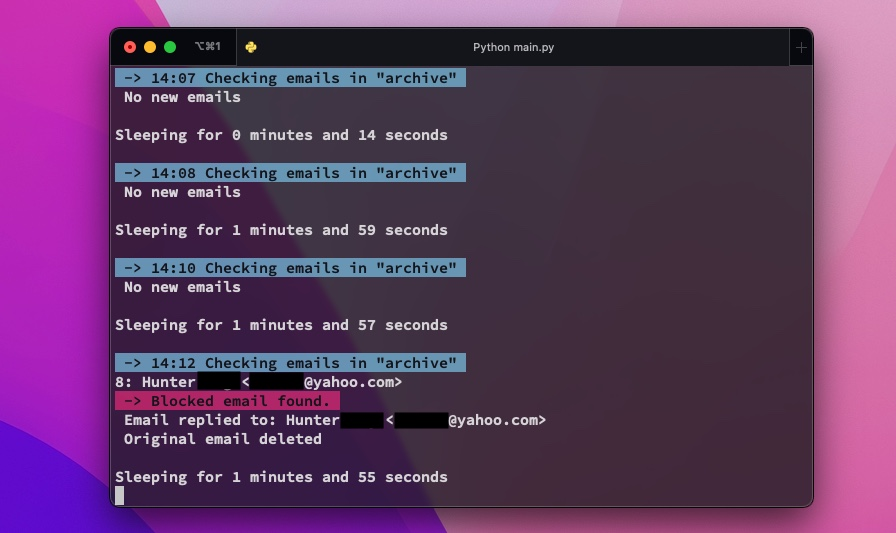

A very simple bot that deletes blocked emails and/or auto-replies.

Most email services don't have a way to completely block emails or configure auto-replies. This bot can do that for you.

## ⏱ Quick Start
Simply run this from the terminal get started:
```
git clone https://github.com/hunterunger/emailBlockBot.git
cd emailBlockBot
python3 main.py
```
If you have 2FA enabled, you will need to generate an app-specific password from your mail account.

## ⭐️ Features
* Block emails
* Reply to blocked emails with fancy HTML (or delete the HTML file to only send plain text)
* Archive blocked messages to a plain text file
* Handles internet connection issues
* No external dependencies
* Work with any IMAP/SMTP mail account. 
* Easy to use and customize

Run `python3 setup_wizzard.py` if you want to configure the bot without running it right away.

Or you can edit `config files/config.yml` directly while the program is running.

## ⚠️ Note!
Blacklist email are set to _PERMANENTLY DELETE_ from your mail account by default, like a spam filter. It skips the trash.
Do not blacklist emails you don't want gone forever! 

Plain text archives are saved by default, but you can change that in the config.